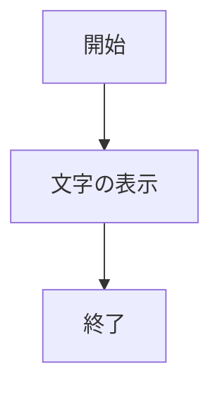
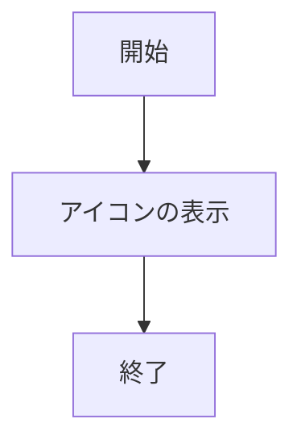
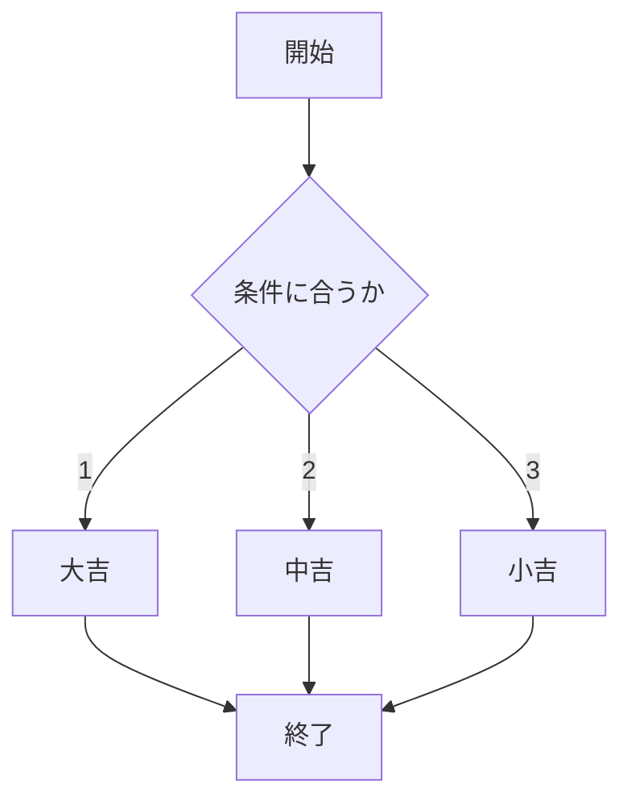
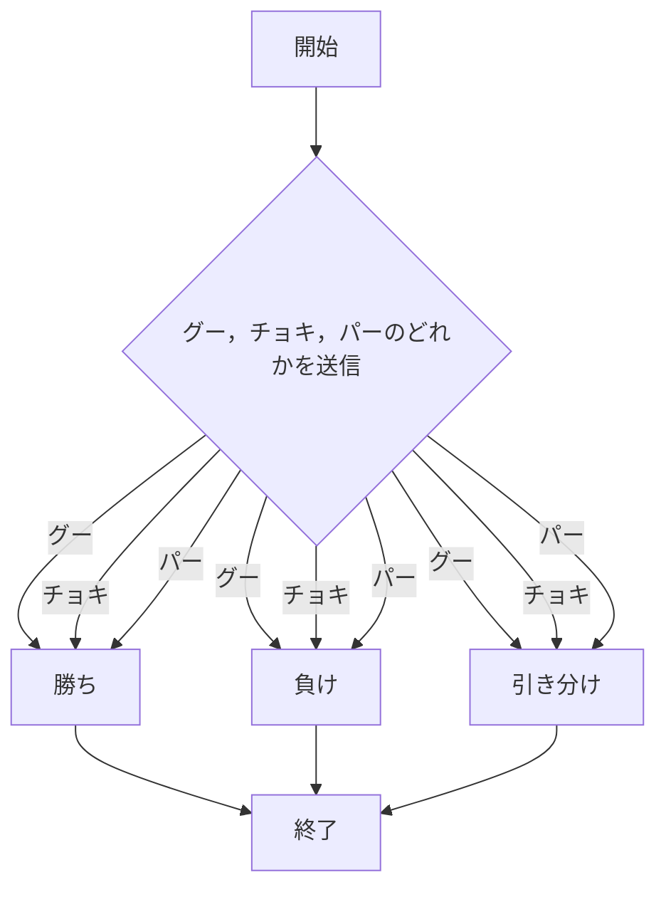
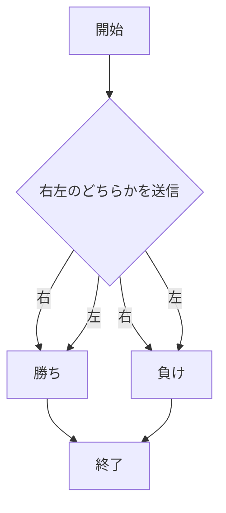
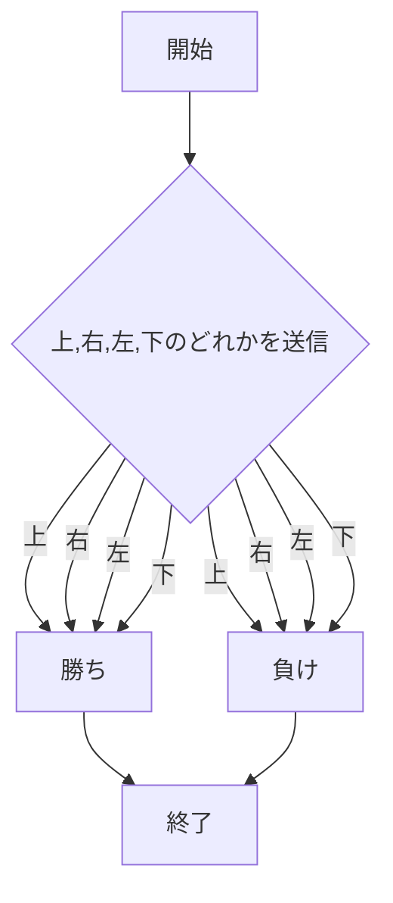

# webpro_06
11月12日
## このプログラムについて
## ファイル一覧
ファイル名 | 説明
-|-
app5.js | プログラム全体
public/test.html | htmlのテスト用の画面
public/janken.html | じゃんけんの開始画面
views/show.ejs | Hello WorldとBon jourが表示されるテンプレートファイル
views/icon.ejs | Appleのロゴが表示されるテンプレートファイル
views/luck.ejs | おみくじができるテンプレートファイル
views/janken.ejs | じゃんけんをするテンプレートファイル
views/nibuiti.ejs | 2分の1ををてるゲームのテンプレートファイル
views/attimuite.ejs | コンピュータとあっち向いてホイをするためのテンプレートファイル

```javascript
console.log("Hello");
```

## 使用方法
### show.ejs
1. ターミナルを開き```cd Desktop```，```cd webpuro```，```cd webpro_06```の順に実行する．
1. ターミナル内で```node app5.js```を実行する．
1. webブラウザ内で http://localhost:8080/hello1 または，http://localhost:8080/hello2 にアクセスする．
1. Hello WorldとBon jourが表示される．




### icon.ejs
1. ターミナルを開き```cd Desktop```，```cd webpuro```，```cd webpro_06```の順に実行する．
1. ターミナル内で```node app5.js```を実行する．
1. webブラウザ内で http://localhost:8080/icon にアクセスする．
1. Appleのロゴが表示される．



### luck.ejs
1. ターミナルを開き```cd Desktop```，```cd webpuro```，```cd webpro_06```の順に実行する．
1. ターミナル内で```node app5.js```を実行する．
1. webブラウザ内で http://localhost:8080/luck にアクセスする．
1. 運勢が大吉，中吉，小吉の中から選ばれる．



### janken.ejs
1.  ターミナルを開き```cd Desktop```，```cd webpuro```，```cd webpro_06```の順に実行する．
1. ```node app5.js```を実行する
1. webブラウザでlocalhost:8080/public/janken.htmlにアクセスする．
1. 自分の手，グー，チョキ，パーのどれかを入力して送信する．



### nibuiti.ejs
1. ターミナルを開き```cd Desktop```，```cd webpuro```，```cd webpro_06```の順に実行する．
1. ターミナル内で```node app5.js```を実行する．
1. webブラウザ内で http://localhost:8080/nibuiti にアクセスする．
1. コンピュータが右と左どちらなのかを予想し右，左のどちらかを入力し送信する．



### atiimuite.ejs
1. ターミナルを開き```cd Desktop```，```cd webpuro```，```cd webpro_06```の順に実行する．
1. ターミナル内で```node app5.js```を実行する．
1. webブラウザ内で http://localhost:8080/attimuite にアクセスする．
1. コンピュータが上，右，左，下のどちらの方向に向くのかを予想し上，右，左，下のどれかを入力し送信する．

